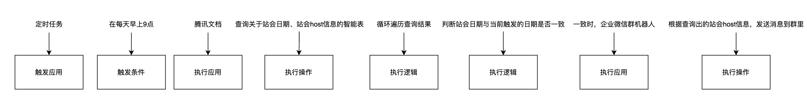
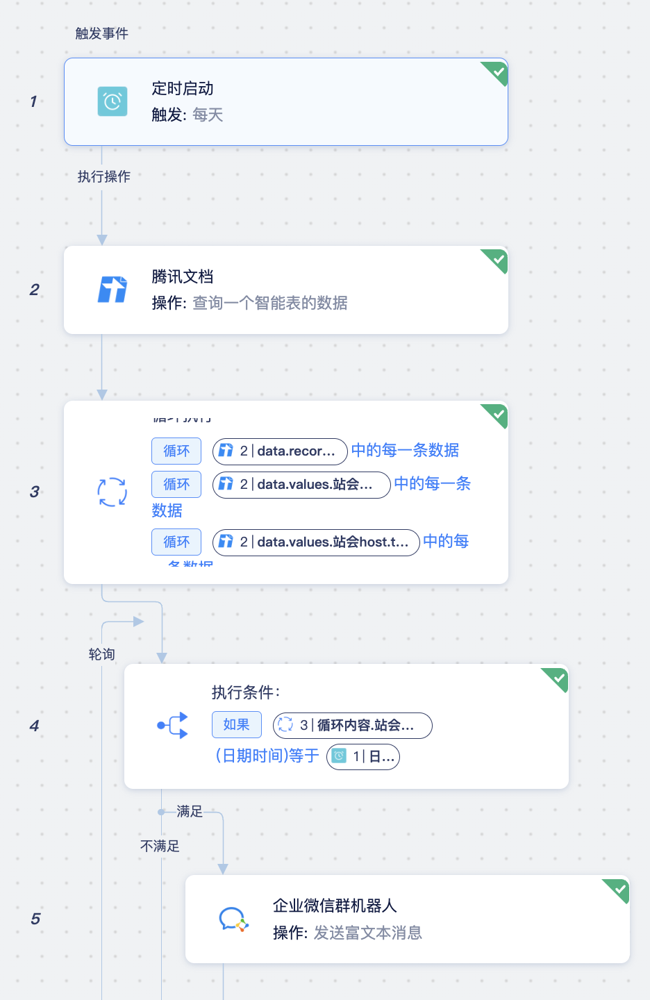

## 背景

在日常工作中，有许多低效的重复性工作，例如：多表格之间的文档整理比对、发票粘贴、线索手动录入、定时发送企业微信提醒等。许多时间被这些**重复性、高耗时、低价值**的工作占据。
而针对这类**重复、定期发生、具有一定规律**的工作，通过腾讯云推出的HiFlow场景连接器，我们可以把繁杂重复的日常工作变成全自动的流程，不用写代码，随时可修改、可管理。

## HiFlow简介

根据官方文档所述，腾讯云HiFlow场景连接器是办公必备的自动化流程小助理。

不会写代码？没关系，我们可以**零代码的连接多个应用**，鼠标轻点即可轻松设置自动化的工作流程&数据流程，通过场景连接器，可以轻松快速实现如下自动化流程：

* 每周五9点，自动发送企业微信群通知，收集周报
* 在收到一个腾讯问卷调研时，数据自动归档腾讯文档
* 腾讯广告落地页收到一条线索之后，自动在CRM创建更新数据

## 如何使用HiFlow

官网中对于HiFlow的使用有着详细的文档说明，并提供了许多模版应用方便初学者快速上手。在此，以我们小马团队项目中的自动化任务为例，简单介绍下基本的配置流程。

在项目中，需要每天早上9点定时地在企业微信群里，发送当日站会的host信息，以提醒大家参加及时参与站会。因此，在制作此流程之前，需要先定义好流程的触发应用、触发事件、执行应用、执行操作，复杂的时候还需要增加一些逻辑判断。

**触发应用：**
触发应用是流程逻辑的起点，根据触发应用的状态变化，来作为自动化流程是否执行的判断。
在腾讯云HiFlow场景连接器中，“定时启动”也是一个常用的触发应用，比如在设定的执行时间，这个自动化流程就会自动触发。
本例中，就使用到了定时任务。

**触发事件**：
触发事件，特指我们为触发应用设定的，自动执行流程的触发条件。
本例中，使用的触发条件是每天早上9点。

**执行应用**：
执行应用，指当满足触发条件后，后续开始执行的应用。
本例中，定时任务满足触发条件：每天早上9点，后续腾讯文档自动开始执行，腾讯文档即为执行应用。

**执行操作** **：**
操作事件是指触发应用的触发事件发生后，判断条件满足，则自动让设定的应用来执行指定的操作事件。 
本例中，查询智能表即为腾讯文档应用执行的操作。

**执行逻辑**：
在复杂情况下，需要进行逻辑判断，可以使用内置的执行逻辑（执行条件、执行控制、循环执行、执行终止、执行延迟、错误处理）。
本例中使用到了循环执行、执行条件，来控制企业微信群机器人的消息发送。

具体流程图如下：

注：

1. 目前HiFlow还处于初步阶段，在实践中使用官方推荐的Viga表来存储数据时，发生了接口调用失败的情况，因此，推荐使用腾讯公司制作的应用（如腾讯文档、腾讯问卷等），连接效果更佳。
2. 出现异常时，可通过流程日志查看出错的信息，并可联系客服来进行问题的排查。
3. 目前HiFlow暂时是免费使用的。

## 总结

目前腾讯云HiFlow场景连接器已经支持200+应用,能够满足市场销售、财务、行政HR、产品研发、办公协同等多类连接场景。

**办公协同类**：腾讯文档、维格表、腾讯问卷、腾讯会议、TAPD等。

**信息收发类**：qq邮箱、163邮箱、腾讯云短信、腾讯云邮件、腾讯云呼叫中心、腾讯企点等。

**腾讯AI 识别**：身份证识别、银行卡识别、火车票识别、试题识别、营业执照识别等。

**电子商务类**：微盟、有赞、微店、微信小商店等。

**广告投放类**：腾讯广告、巨量引擎等。

**市场销售类**：六度EC、微伴助手、尘锋SCRM、销售易、纷享销客等。

**实用工具类**：腾讯地图、高德地图、百度地图、5118、Tushare、聚合数据等。

如果大家有相关多应用、自动化的需求，可以从官网上了解更多具体应用的信息和集成的方式，点击[应用中心](https://ssp.cloud.tencent.com/apps/list)查看。希望本篇文章能帮助到大家在日常工作中解决一些重复性较高的工作，提高工作效率。

参考链接：

1. [HiFlow帮助中心](https://hiflow.tencent.com/docs)
2. [HiFlow应用中心](https://hiflow.tencent.com/apps/list)