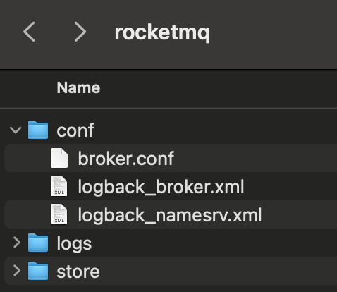
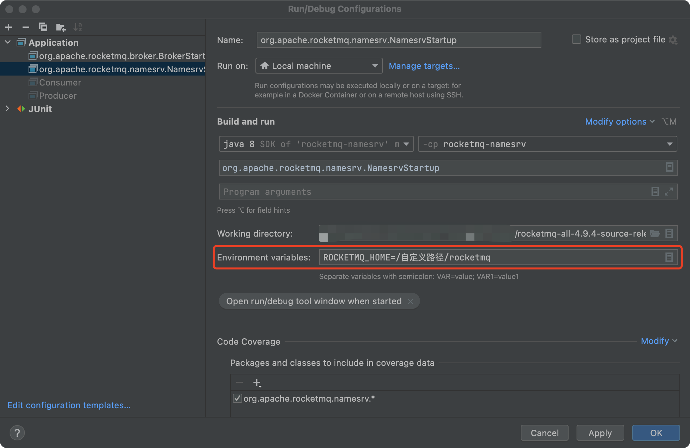
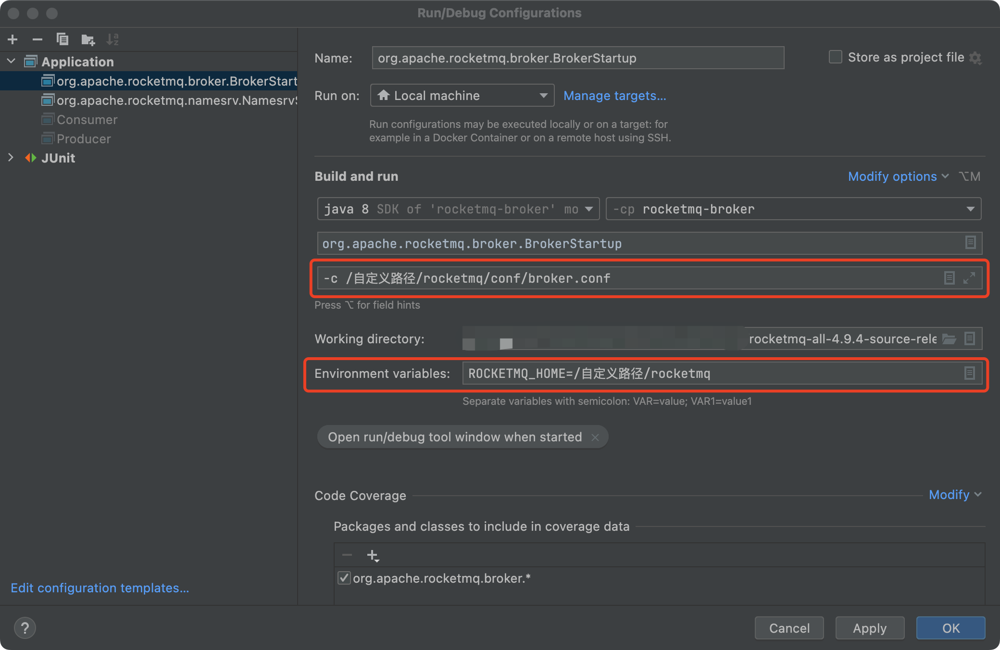

# 一、版本说明

本次搭建采用：

JDK：1.8

RocketMQ： latest 4.9.4

Dashboard：latest

Maven：latest

注：Java版本过高可能会出现项目build失败的情况，因此推荐使用1.8版本。

# 二、RocketMQ 本地搭建

官网下载地址：<https://dlcdn.apache.org/rocketmq/4.9.4/rocketmq-all-4.9.4-source-release.zip>

源码git仓库：<https://github.com/apache/rocketmq>

## 1、准备项目文件

1. 前往官网下载rocketmq-all-4.9.4-source-release.zip压缩包，并解压。
2. IDEA打开解压后的项目路径
3. 在`/自定义路径`中新建`/rocketmq`文件夹（用于存放conf配置文件、日志以及mq的一些存储文件）

   

   conf：将源码中distribution模块中的配置文件拷贝到该目录

   `broker.conf`文件添加自定义配置：

   ```xml
   # Licensed to the Apache Software Foundation (ASF) under one or more

   brokerClusterName = DefaultCluster
   brokerName = broker-a
   brokerId = 0
   # broker连接本地的namesrv
   namesrvAddr = 127.0.0.1:9876
   deleteWhen = 04
   fileReservedTime = 48
   brokerRole = ASYNC_MASTER
   flushDiskType = ASYNC_FLUSH

   ###########################################添加以下配置，路径请修改为自己的正确路径
   # 配置存储位置，配置成上面新创建的路径
   storePathRootDir = /自定义路径/rocketmq/store
   # commitlog 存储路径
   storePathCommitLog = /自定义路径/rocketmq/store/commitlog
   # 消费队列存储路径
   storePathConsumeQueue = /自定义路径/rocketmq/store/commitlog/store/consumequeue
   # 消息索引存储路径
   storePathIndex = /自定义路径/rocketmq/store/index
   # checkpoint文件存储路径
   storeCheckPoint = /自定义路径/rocketmq/store/checkpoint
   # abort文件存储路径
   abortFile = /自定义路径/rocketmq/store/abort
   ```

   `logback_broker.xml`与`logback_namesrv.xml`文件添加`property`：

   ```xml
   <configuration>
       <property name="user.home" value="/自定义路径/rocketmq"/>
       ...
   </configuration>
   ```

   logs：日志路径，初始目录为空 store：存储相关内容，初始目录为空


## 2、项目启动

### 1. 启动Name Server

文件路径：org/apache/rocketmq/namesrv/NamesrvStartup.java

启动前，配置Environment variables：`ROCKETMQ_HOME=/自定义路径/rocketmq`



启动成功后输出log：

```shell
The Name Server boot success. serializeType=JSON
```

### 2. 启动Broker

文件路径：org/apache/rocketmq/broker/BrokerStartup.java

启动前，除了配置`ROCKETMQ_HOME`，还需要指定Program arguments为：`-c /自定义路径/rocketmq/conf/broker.conf`



### 3. Producer发送Message

文件路径：org/apache/rocketmq/example/quickstart/Producer.java

启动前，可自定义消息发送的数量、Group、Topic、Tag等，并指定name server的地址。

```java
/*
 * Licensed to the Apache Software Foundation (ASF) under one or more
 * contributor license agreements.  See the NOTICE file distributed with
 * this work for additional information regarding copyright ownership.
 * The ASF licenses this file to You under the Apache License, Version 2.0
 * (the "License"); you may not use this file except in compliance with
 * the License.  You may obtain a copy of the License at
 *
 *     http://www.apache.org/licenses/LICENSE-2.0
 *
 * Unless required by applicable law or agreed to in writing, software
 * distributed under the License is distributed on an "AS IS" BASIS,
 * WITHOUT WARRANTIES OR CONDITIONS OF ANY KIND, either express or implied.
 * See the License for the specific language governing permissions and
 * limitations under the License.
 */
package org.apache.rocketmq.example.quickstart;

import org.apache.rocketmq.client.exception.MQClientException;
import org.apache.rocketmq.client.producer.DefaultMQProducer;
import org.apache.rocketmq.client.producer.SendResult;
import org.apache.rocketmq.common.message.Message;
import org.apache.rocketmq.remoting.common.RemotingHelper;

/**
 * This class demonstrates how to send messages to brokers using provided {@link DefaultMQProducer}.
 */
public class Producer {

    /**
     * The number of produced messages.
     */
    public static final int MESSAGE_COUNT = 5;
    public static final String PRODUCER_GROUP = "group_name_test";
    public static final String DEFAULT_NAMESRVADDR = "127.0.0.1:9876";
    public static final String TOPIC = "TopicTest";
    public static final String TAG = "TagA";

    public static void main(String[] args) throws MQClientException, InterruptedException {

        /*
         * Instantiate with a producer group name.
         */
        DefaultMQProducer producer = new DefaultMQProducer(PRODUCER_GROUP);

        /*
         * Specify name server addresses.
         *
         * Alternatively, you may specify name server addresses via exporting environmental variable: NAMESRV_ADDR
         * <pre>
         * {@code
         *  producer.setNamesrvAddr("name-server1-ip:9876;name-server2-ip:9876");
         * }
         * </pre>
         */
        // Uncomment the following line while debugging, namesrvAddr should be set to your local address
        producer.setNamesrvAddr(DEFAULT_NAMESRVADDR);

        /*
         * Launch the instance.
         */
        producer.start();

        for (int i = 0; i < MESSAGE_COUNT; i++) {
            try {

                /*
                 * Create a message instance, specifying topic, tag and message body.
                 */
                Message msg = new Message(TOPIC /* Topic */,
                    TAG /* Tag */,
                    ("Hello RocketMQ " + i).getBytes(RemotingHelper.DEFAULT_CHARSET) /* Message body */
                );

                /*
                 * Call send message to deliver message to one of brokers.
                 */
                SendResult sendResult = producer.send(msg);
                /*
                 * There are different ways to send message, if you don't care about the send result,you can use this way
                 * {@code
                 * producer.sendOneway(msg);
                 * }
                 */

                /*
                 * if you want to get the send result in a synchronize way, you can use this send method
                 * {@code
                 * SendResult sendResult = producer.send(msg);
                 * System.out.printf("%s%n", sendResult);
                 * }
                 */

                /*
                 * if you want to get the send result in a asynchronize way, you can use this send method
                 * {@code
                 *
                 *  producer.send(msg, new SendCallback() {
                 *  @Override
                 *  public void onSuccess(SendResult sendResult) {
                 *      // do something
                 *  }
                 *
                 *  @Override
                 *  public void onException(Throwable e) {
                 *      // do something
                 *  }
                 *});
                 *
                 *}
                 */

                System.out.printf("%s%n", sendResult);
            } catch (Exception e) {
                e.printStackTrace();
                Thread.sleep(1000);
            }
        }

        /*
         * Shut down once the producer instance is not longer in use.
         */
        producer.shutdown();
    }
}
```

启动成功后，控制台打印：

```shell
SendResult [sendStatus=SEND_OK, msgId=7F0000015FE118B4AAC247F368F30000, offsetMsgId=0ACB563700002A9F000000000002F148, messageQueue=MessageQueue [topic=TopicTest, brokerName=broker-a, queueId=0], queueOffset=252]

SendResult [sendStatus=SEND_OK, msgId=7F0000015FE118B4AAC247F3694C0001, offsetMsgId=0ACB563700002A9F000000000002F206, messageQueue=MessageQueue [topic=TopicTest, brokerName=broker-a, queueId=1], queueOffset=251]

SendResult [sendStatus=SEND_OK, msgId=7F0000015FE118B4AAC247F369540002, offsetMsgId=0ACB563700002A9F000000000002F2C4, messageQueue=MessageQueue [topic=TopicTest, brokerName=broker-a, queueId=2], queueOffset=251]

SendResult [sendStatus=SEND_OK, msgId=7F0000015FE118B4AAC247F3695E0003, offsetMsgId=0ACB563700002A9F000000000002F382, messageQueue=MessageQueue [topic=TopicTest, brokerName=broker-a, queueId=3], queueOffset=251]

SendResult [sendStatus=SEND_OK, msgId=7F0000015FE118B4AAC247F369620004, offsetMsgId=0ACB563700002A9F000000000002F440, messageQueue=MessageQueue [topic=TopicTest, brokerName=broker-a, queueId=0], queueOffset=253]
```

### 4. Consumer消费Message

文件路径：org/apache/rocketmq/example/quickstart/Consumer.java

启动前，可指定自定义的Group、Topic、Tag等，并指定name server的地址。

```java
/*
 * Licensed to the Apache Software Foundation (ASF) under one or more
 * contributor license agreements.  See the NOTICE file distributed with
 * this work for additional information regarding copyright ownership.
 * The ASF licenses this file to You under the Apache License, Version 2.0
 * (the "License"); you may not use this file except in compliance with
 * the License.  You may obtain a copy of the License at
 *
 *     http://www.apache.org/licenses/LICENSE-2.0
 *
 * Unless required by applicable law or agreed to in writing, software
 * distributed under the License is distributed on an "AS IS" BASIS,
 * WITHOUT WARRANTIES OR CONDITIONS OF ANY KIND, either express or implied.
 * See the License for the specific language governing permissions and
 * limitations under the License.
 */
package org.apache.rocketmq.example.quickstart;

import org.apache.rocketmq.client.consumer.DefaultMQPushConsumer;
import org.apache.rocketmq.client.consumer.listener.ConsumeConcurrentlyStatus;
import org.apache.rocketmq.client.consumer.listener.MessageListenerConcurrently;
import org.apache.rocketmq.client.exception.MQClientException;
import org.apache.rocketmq.common.consumer.ConsumeFromWhere;

/**
 * This example shows how to subscribe and consume messages using providing {@link DefaultMQPushConsumer}.
 */
public class Consumer {

    public static final String CONSUMER_GROUP = "group_name_test";
    public static final String DEFAULT_NAMESRVADDR = "127.0.0.1:9876";
    public static final String TOPIC = "TopicTest";

    public static void main(String[] args) throws InterruptedException, MQClientException {

        /*
         * Instantiate with specified consumer group name.
         */
        DefaultMQPushConsumer consumer = new DefaultMQPushConsumer(CONSUMER_GROUP);

        /*
         * Specify name server addresses.
         * <p/>
         *
         * Alternatively, you may specify name server addresses via exporting environmental variable: NAMESRV_ADDR
         * <pre>
         * {@code
         * consumer.setNamesrvAddr("name-server1-ip:9876;name-server2-ip:9876");
         * }
         * </pre>
         */
        // Uncomment the following line while debugging, namesrvAddr should be set to your local address
        consumer.setNamesrvAddr(DEFAULT_NAMESRVADDR);

        /*
         * Specify where to start in case the specific consumer group is a brand-new one.
         */
        consumer.setConsumeFromWhere(ConsumeFromWhere.CONSUME_FROM_FIRST_OFFSET);

        /*
         * Subscribe one more topic to consume.
         */
        consumer.subscribe(TOPIC, "*");

        /*
         *  Register callback to execute on arrival of messages fetched from brokers.
         */
        consumer.registerMessageListener((MessageListenerConcurrently) (msg, context) -> {
            System.out.printf("%s Receive New Messages: %s %n", Thread.currentThread().getName(), msg);
            return ConsumeConcurrentlyStatus.CONSUME_SUCCESS;
        });

        /*
         *  Launch the consumer instance.
         */
        consumer.start();

        System.out.printf("Consumer Started.%n");
    }
}
```

启动成功后，控制台打印：

```shell
ConsumeMessageThread_group_name_test_5 Receive New Messages: [MessageExt [brokerName=broker-a, queueId=0, storeSize=190, queueOffset=253, sysFlag=0, bornTimestamp=1660490334562, bornHost=/10.203.86.55:54981, storeTimestamp=1660490334565, storeHost=/10.203.86.55:10911, msgId=0ACB563700002A9F000000000002F440, commitLogOffset=193600, bodyCRC=601994070, reconsumeTimes=0, preparedTransactionOffset=0, toString()=Message{topic='TopicTest', flag=0, properties={MIN_OFFSET=0, MAX_OFFSET=254, CONSUME_START_TIME=1660490704739, UNIQ_KEY=7F0000015FE118B4AAC247F369620004, CLUSTER=DefaultCluster, TAGS=TagA}, body=[72, 101, 108, 108, 111, 32, 82, 111, 99, 107, 101, 116, 77, 81, 32, 52], transactionId='null'}]] 

ConsumeMessageThread_group_name_test_2 Receive New Messages: [MessageExt [brokerName=broker-a, queueId=3, storeSize=190, queueOffset=251, sysFlag=0, bornTimestamp=1660490334558, bornHost=/10.203.86.55:54981, storeTimestamp=1660490334560, storeHost=/10.203.86.55:10911, msgId=0ACB563700002A9F000000000002F382, commitLogOffset=193410, bodyCRC=1032136437, reconsumeTimes=0, preparedTransactionOffset=0, toString()=Message{topic='TopicTest', flag=0, properties={MIN_OFFSET=0, MAX_OFFSET=252, CONSUME_START_TIME=1660490704739, UNIQ_KEY=7F0000015FE118B4AAC247F3695E0003, CLUSTER=DefaultCluster, TAGS=TagA}, body=[72, 101, 108, 108, 111, 32, 82, 111, 99, 107, 101, 116, 77, 81, 32, 51], transactionId='null'}]] 

ConsumeMessageThread_group_name_test_4 Receive New Messages: [MessageExt [brokerName=broker-a, queueId=0, storeSize=190, queueOffset=252, sysFlag=0, bornTimestamp=1660490334453, bornHost=/10.203.86.55:54981, storeTimestamp=1660490334484, storeHost=/10.203.86.55:10911, msgId=0ACB563700002A9F000000000002F148, commitLogOffset=192840, bodyCRC=613185359, reconsumeTimes=0, preparedTransactionOffset=0, toString()=Message{topic='TopicTest', flag=0, properties={MIN_OFFSET=0, MAX_OFFSET=254, CONSUME_START_TIME=1660490704739, UNIQ_KEY=7F0000015FE118B4AAC247F368F30000, CLUSTER=DefaultCluster, TAGS=TagA}, body=[72, 101, 108, 108, 111, 32, 82, 111, 99, 107, 101, 116, 77, 81, 32, 48], transactionId='null'}]] 

ConsumeMessageThread_group_name_test_1 Receive New Messages: [MessageExt [brokerName=broker-a, queueId=1, storeSize=190, queueOffset=251, sysFlag=0, bornTimestamp=1660490334540, bornHost=/10.203.86.55:54981, storeTimestamp=1660490334544, storeHost=/10.203.86.55:10911, msgId=0ACB563700002A9F000000000002F206, commitLogOffset=193030, bodyCRC=1401636825, reconsumeTimes=0, preparedTransactionOffset=0, toString()=Message{topic='TopicTest', flag=0, properties={MIN_OFFSET=0, MAX_OFFSET=252, CONSUME_START_TIME=1660490704739, UNIQ_KEY=7F0000015FE118B4AAC247F3694C0001, CLUSTER=DefaultCluster, TAGS=TagA}, body=[72, 101, 108, 108, 111, 32, 82, 111, 99, 107, 101, 116, 77, 81, 32, 49], transactionId='null'}]] 

ConsumeMessageThread_group_name_test_3 Receive New Messages: [MessageExt [brokerName=broker-a, queueId=2, storeSize=190, queueOffset=251, sysFlag=0, bornTimestamp=1660490334548, bornHost=/10.203.86.55:54981, storeTimestamp=1660490334556, storeHost=/10.203.86.55:10911, msgId=0ACB563700002A9F000000000002F2C4, commitLogOffset=193220, bodyCRC=1250039395, reconsumeTimes=0, preparedTransactionOffset=0, toString()=Message{topic='TopicTest', flag=0, properties={MIN_OFFSET=0, MAX_OFFSET=252, CONSUME_START_TIME=1660490704739, UNIQ_KEY=7F0000015FE118B4AAC247F369540002, CLUSTER=DefaultCluster, TAGS=TagA}, body=[72, 101, 108, 108, 111, 32, 82, 111, 99, 107, 101, 116, 77, 81, 32, 50], transactionId='null'}]] 


```

### 5. Dashboard启动

git：<https://github.com/apache/rocketmq-dashboard>

下载源码后，使用mvn启动

```shell
mvn clean package -Dmaven.test.skip=true
java -jar target/rocketmq-dashboard-1.0.1-SNAPSHOT.jar
```

启动后，可以查看消费的一些记录：


# 三、扩展—相关术语

取自官方的介绍文档：<https://github.com/apache/rocketmq/blob/master/docs/cn/concept.md>

## 1 消息模型（Message Model）

RocketMQ主要由 Producer、Broker、Consumer 三部分组成，其中Producer 负责生产消息，Consumer 负责消费消息，Broker 负责存储消息。Broker 在实际部署过程中对应一台服务器，每个 Broker 可以存储多个Topic的消息，每个Topic的消息也可以分片存储于不同的 Broker。Message Queue 用于存储消息的物理地址，每个Topic中的消息地址存储于多个 Message Queue 中。ConsumerGroup 由多个Consumer 实例构成。

## 2 消息生产者（Producer）

负责生产消息，一般由业务系统负责生产消息。一个消息生产者会把业务应用系统里产生的消息发送到broker服务器。RocketMQ提供多种发送方式，同步发送、异步发送、顺序发送、单向发送。同步和异步方式均需要Broker返回确认信息，单向发送不需要。

## 3 消息消费者（Consumer）

负责消费消息，一般是后台系统负责异步消费。一个消息消费者会从Broker服务器拉取消息、并将其提供给应用程序。从用户应用的角度而言提供了两种消费形式：拉取式消费、推动式消费。

## 4 主题（Topic）

表示一类消息的集合，每个主题包含若干条消息，每条消息只能属于一个主题，是RocketMQ进行消息订阅的基本单位。

## 5 代理服务器（Broker Server）

消息中转角色，负责存储消息、转发消息。代理服务器在RocketMQ系统中负责接收从生产者发送来的消息并存储、同时为消费者的拉取请求作准备。代理服务器也存储消息相关的元数据，包括消费者组、消费进度偏移和主题和队列消息等。

## 6 名字服务（Name Server）

名称服务充当路由消息的提供者。生产者或消费者能够通过名字服务查找各主题相应的Broker IP列表。多个Namesrv实例组成集群，但相互独立，没有信息交换。

## 7 拉取式消费（Pull Consumer）

Consumer消费的一种类型，应用通常主动调用Consumer的拉消息方法从Broker服务器拉消息、主动权由应用控制。一旦获取了批量消息，应用就会启动消费过程。

## 8 推动式消费（Push Consumer）

Consumer消费的一种类型，该模式下Broker收到数据后会主动推送给消费端，该消费模式一般实时性较高。

## 9 生产者组（Producer Group）

同一类Producer的集合，这类Producer发送同一类消息且发送逻辑一致。如果发送的是事务消息且原始生产者在发送之后崩溃，则Broker服务器会联系同一生产者组的其他生产者实例以提交或回溯消费。

## 10 消费者组（Consumer Group）

同一类Consumer的集合，这类Consumer通常消费同一类消息且消费逻辑一致。消费者组使得在消息消费方面，实现负载均衡和容错的目标变得非常容易。要注意的是，消费者组的消费者实例必须订阅完全相同的Topic。RocketMQ 支持两种消息模式：集群消费（Clustering）和广播消费（Broadcasting）。

## 11 集群消费（Clustering）

集群消费模式下,相同Consumer Group的每个Consumer实例平均分摊消息。

## 12 广播消费（Broadcasting）

广播消费模式下，相同Consumer Group的每个Consumer实例都接收全量的消息。

## 13 普通顺序消息（Normal Ordered Message）

普通顺序消费模式下，消费者通过同一个消息队列（ Topic 分区，称作 Message Queue） 收到的消息是有顺序的，不同消息队列收到的消息则可能是无顺序的。

## 14 严格顺序消息（Strictly Ordered Message）

严格顺序消息模式下，消费者收到的所有消息均是有顺序的。

## 15 消息（Message）

消息系统所传输信息的物理载体，生产和消费数据的最小单位，每条消息必须属于一个主题。RocketMQ中每个消息拥有唯一的Message ID，且可以携带具有业务标识的Key。系统提供了通过Message ID和Key查询消息的功能。

## 16 标签（Tag）

为消息设置的标志，用于同一主题下区分不同类型的消息。来自同一业务单元的消息，可以根据不同业务目的在同一主题下设置不同标签。标签能够有效地保持代码的清晰度和连贯性，并优化RocketMQ提供的查询系统。消费者可以根据Tag实现对不同子主题的不同消费逻辑，实现更好的扩展性。

## 参考资料

* [Mac搭建单机版RocketMQ-4.9.3](https://blog.csdn.net/u010066934/article/details/124785368)
* [RocketMQ—Quick Start](https://rocketmq.apache.org/docs/quick-start/)
* [RocketMQ—Concept](https://github.com/apache/rocketmq/blob/master/docs/cn/concept.md)